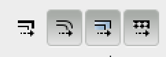

Title: Laser Cutter Info
Template: 720

##Software Setup
Install [Inkscape](http://inkscape.org) or use a lab machine with Adobe
Illustrator on it. If you have another 2D design program you really
like, you are welcome to use it instead.

###Inkscape
1. Create a new document
2. Go to File -> Document Properties
3. Under the Page tab, change Default units to "in"
4. Under "Custom Size" on the Page tab, change Units to "in", Width to
   32 and height to 18
5. Close the Document Properties window
6. In the toolbar, find the set of icons that look like
	 .
	 Click the leftmost icon to turn it off, so it looks like
	 .
	 This operation disables the defaul behavior of scaling the width of
	 an object's line when you change the size of the object.

###Illustrator
1. Go to File -> New
2. In the New Document window, change the Units to "Inches", Width to
	 32 in and Height to 18 in
3. Open the Advanced area
4. Change Color Mode to RGB

##Preparing your graphics
You can make two different kinds of cuts: vector or raster. Vector is
a "cut": the laser follows the line you set. Raster is more like an
inkjet printer: the laser goes back and forth to create an image or
engraving.

In order to select raster or vector, you change two 

The laser cutter works via a print driver. This is good, because it
means that you don't have to use a particular program. This is bad,
because you have to set strange settings in your programs.

The laser cutter's default behavior is to raster, or engrave. Even
vectorized lines will be in raster mode by default. For every line in
your design that you want to cut rather than raster, you must do two
things.

1. First, you must set the line color to 100% red. It must be
	 exactly RGB (255, 0, 0). This is why in Illustrator you must set the
	 color mode to RGB instead of CMYK.
2. Second, you must set the line to be equal to or less than 1,000th
	 of an inch thick, or <= .001 inches. 

When the laser cutter gets a line that looks like this, then it will
cut it with the power level you instruct in the print control panel.
