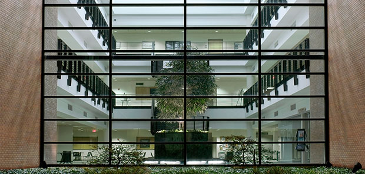
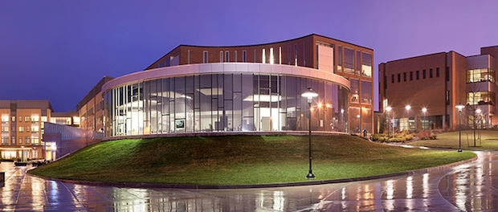

Title: IST Faculty Search
NoLeftSidebar: True
NoRightSidebar: True

#IST Faculty Search

	

The Department of Information Sciences and Technologies is hiring!
We're accepting applications in multiple areas, including **HCI**.

[Click here to
apply](https://sjobs.brassring.com/tgwebhost/jobdetails.aspx?jobId=1218708&PartnerId=25483&SiteId=5291)

Our HCI faculty research, teach, and advise PhD students in a wide
variety of areas, including accessibility, perception, digital
fabrication, and wearable computing. The department offers a BS in
Human-Centered Computing, a MS in HCI, and faculty members advise PhD
students in the college-wide Computing and Information Sciences PhD
program.

Current HCI faculty members in
the Golisano College of Computing and Information Sciences include:

- ACM Vice President and Distinguished Professor [Vicki
	Hanson](https://en.wikipedia.org/wiki/Vicki_L._Hanson)
- Interim Dean and Professor [Anne
	Haake](http://hccl.gccis.rit.edu/index.php/people/8-faculty/2-anne-haake)
- Professor [Joe Geigel](https://www.cs.rit.edu/~jmg/)
- Associate Professor [Reynold Bailey](https://www.cs.rit.edu/~rjb/)
- Associate Professor [Matt Huenerfauth](http://huenerfauth.ist.rit.edu/)
- Assistant Professor [Daniel Ashbrook](http://fetlab.rit.edu/dan)

Our world-class HCI faculty's dynamic areas of research include:

- accessibility at the [Center for Accessibility and Inclusion
	Research](http://cair.rit.edu)
- behavior modeling at the [Human-Centric Multi-Modal Modeling
	Lab](http://hccl.gccis.rit.edu)
- graphics and perception at the [CS Computer Graphics and Applied
	Perception Lab](http://www.cs.rit.edu/~graphics/lab/), and
- wearable computing and digital fabrication at the [Future Everyday
	Technology Research Lab](http://fetlab.rit.edu).

For more information about HCI research at RIT, please visit
[http://hci-research.rit.edu](http://hci-research.rit.edu).

##About RIT

	

The [Rochester Institute of Technology](https://www.rit.edu) is a
private Doctoral University in the Finger Lakes region of New York
state. RIT is consistently growing its commitment to research. It 
began its first doctoral program in 1990 in imaging science, the first
in the nation. In the 2000s, RIT added six more in the areas of
astrophysics, color science, computing and information sciences,
engineering, microsystems engineering, and sustainability. Several
interdisciplinary doctoral programs are in the planning stages.

RIT sponsored research grew by 18 percent in 2015, reaching a record
$62 million in funding. RIT received 356 new awards from a variety of
state, federal, corporate, and foundation sponsors. Federal funding
was at an all-time high with the National Science Foundation providing
$13 million and the National Institutes of Health providing $3
million.

Founded in 1829, RIT enrolls more than 18,600 students in more than
200 career-oriented and professional programs, making it among the
largest private universities in the U.S.

The university is internationally [recognized and
ranked](http://rit.edu/overview/rankings-and-recognition) for academic
leadership in business, computing, engineering, imaging science,
liberal arts, sustainability, and fine and applied arts. RIT also
offers unparalleled support services for [deaf and hard-of-hearing
students](http://www.rit.edu/ntid). The [cooperative education
program](http://www.rit.edu/emcs/oce) is one of the oldest and largest
in the nation. [Global partnerships](http://www.rit.edu/global)
include campuses in Croatia, Dubai and Kosovo.

##About Rochester

	

Called the "Flower City,"
[Rochester](https://en.wikipedia.org/wiki/Rochester,_New_York) is the
third largest city in New York state with a metro population of over a
million people. The city is home to Kodak, Xerox, the Eastman School
of Music, and dozens of museums, upscale restaurants and cocktail
bars. Rochester offers excellent access to outdoor activities as well,
with four parks designed by [Frederick Law
Olmsted](https://en.wikipedia.org/wiki/Frederick_Law_Olmsted),
and proximity to Lake Ontario, the Finger Lakes, and several ski
resorts.

Rochester features a low cost of living, little traffic, and an
extraordinarily friendly population. More information about Rochester
can be found at:

- The [Democrat and Chronicle](http://www.democratandchronicle.com/)
	newspaper;
- the alternative [Rochester City
	Newspaper](http://www.rochestercitynewspaper.com/);
- the [Visit Rochester](http://www.visitrochester.com/) website; and
- the [Rochester Wikipedia
	article](https://en.wikipedia.org/wiki/Rochester,_New_York).
