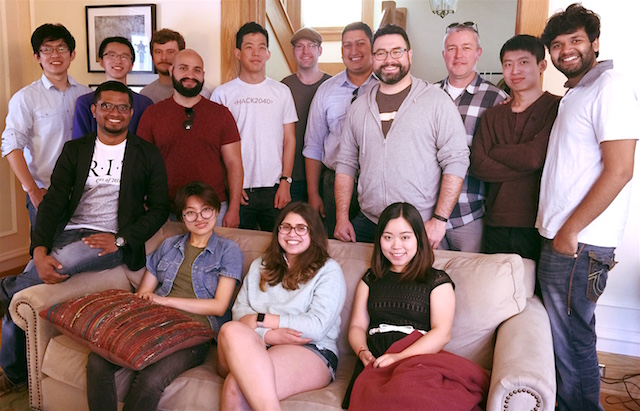

Title: Home
Template: dan
Onload: bibtexify("ashbrook_pubs.bib", "pubTable", {'visualization': false});

##About me
I am an Assistant Professor in the [Department of Information Sciences
and Technologies](http://ist.rit.edu/) and the [Department of Computer
Science](http://www.cs.rit.edu) of the [Golisano College of Computing
and Information Sciences](http://www.rit.edu/gccis/) at the [Rochester
Institute of Technology](http://rit.edu) in Rochester, New York.

**News:** Starting in June 2018, I will be joining the Computer
Science Department of the University of Copenhagen
([DIKU](http://www.diku.dk/english/)) as an Associate Professor in the
[HCC Section](http://www.diku.dk/english/research/hcc/)!

I graduated in 2009 with my Ph.D. in Computer Science from the [School
of Interactive Computing](http://www.ic.gatech.edu/) at [Georgia
Tech](http://www.gatech.edu).  Subsequently, I worked for [Nokia
Research](http://research.nokia.com) and [Samsung
Research](http://sisa.samsung.com) before returning to academia in
2014.

You can download my [CV here](Ashbrook-CV.pdf).

##FETLab

<table class="table-condensed">
	<tr>
		<td width="25%">
			
		</td>
		<td style="vertical-align:middle">
			I founded and direct the <a href="/">Future Everyday Technology
			Research Lab (FETLab)</a>; together with my students I design,
			prototype, and study interactive technology that may one day
			become woven into the fabric of our everyday lives.
		</td>
	</tr>
</table>

Here is a photo of the FETLab members at the end of the 2016 academic
year:

##Research
My research is in the area of **human-computer interaction**, where I
concentrate on new interaction techniques, devices, and applications.
Historically I have concentrated on **wearable and mobile computing**,
with the goal of allowing people to be less focused on their
technology and more engaged with the world, while still reaping the
creativity and productivity benefits of their devices. My current
research continues this thread while adding a second focus on helping
non-experts more easily understand and use **personal fabrication
technology** such as 3D printers, laser cutters, and CNC routers.

My research is supported by [HP](http://hp.com),
[Nokia](http://company.nokia.com), and the [National Science
Foundation](http://nsf.gov).

##Teaching
I teach two classes, which are constantly being updated: HCIN-720 in
Fall semesters, and HCIN-722 in Spring semesters:

###HCIN-720: Prototyping Wearable and Internet of Things Devices
_Software is no longer the only domain that practitioners of
Human-Computer Interaction (HCI) find themselves involved in. There is
a “hardware renaissance” underway in Silicon Valley, and as a result
the computing industry is in need of user experience designers,
interaction designers, and HCI specialists who understand how to work
with people and hardware as well as with software. The goal of this
course is to teach students how to rapidly prototype and evaluate
systems that combine hardware and software._

- [Fall 2016 course page](http://fetlab.rit.edu/720)
- [Fall 2015 course page](http://fetlab.rit.edu/720-fall15)

###HCIN-722: HCI with Mobile, Wearable, and Ubiquitous Devices
_Modern computing devices include more than just mobile phones, with
wearable and ubiquitous (for example, Internet of Things) devices
rapidly emerging as additional platforms. These new devices offer
unique interaction capabilities and challenges. Students will learn to
think about and design effective interactions for mobile, wearable,
and ubiquitous computing devices. Students will also gain a background
in research in these areas. The main goal of the course is to enable
students to work with HCI for these types of devices._

HCIN-722 is a seminar-style course with projects: students read
research papers and discuss them in class; teach a class themselves
on a technical or theoretical topic; and engage in a semester-long
group project around a new wearable or mobile device.

- [Spring 2017 course page](http://fetlab.rit.edu/722)
- [Spring 2016 course page](http://fetlab.rit.edu/722-fall16)
- Spring 2015

##Publications
You can see statistics on my [Google Scholar profile
page](http://scholar.google.com/citations?user=VzkoqhIAAAAJ).

[bib](ashbrook_pubs.bib)

<table class='table' id="pubTable"></table>
